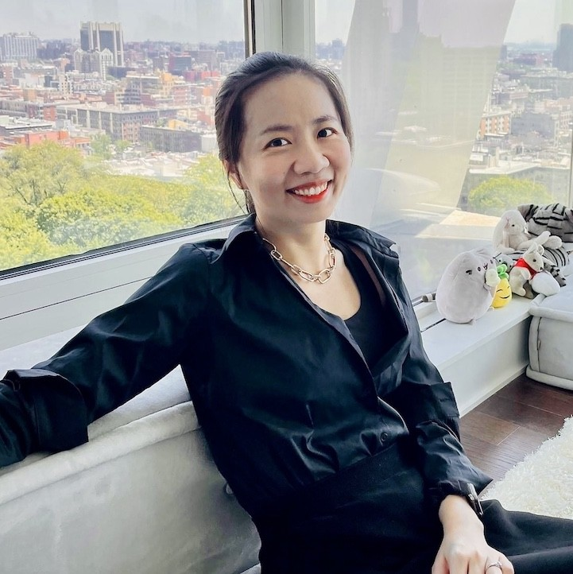
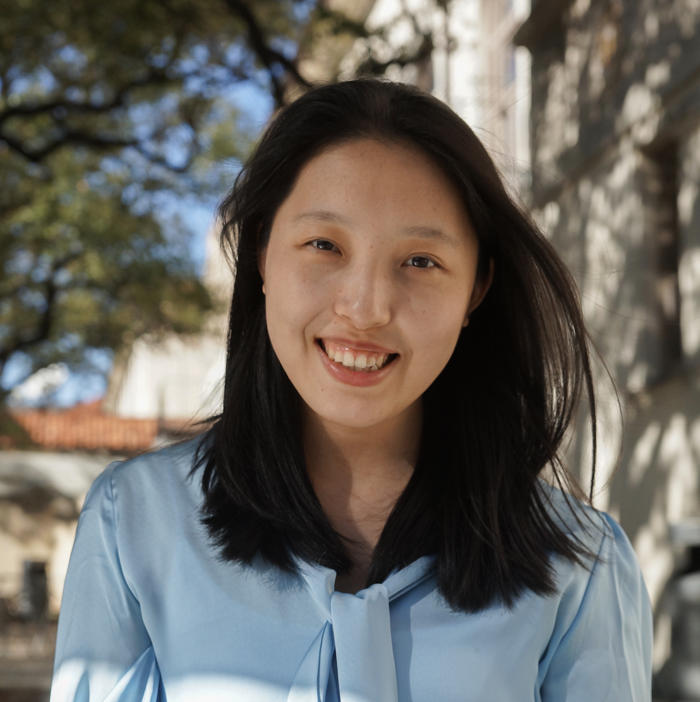
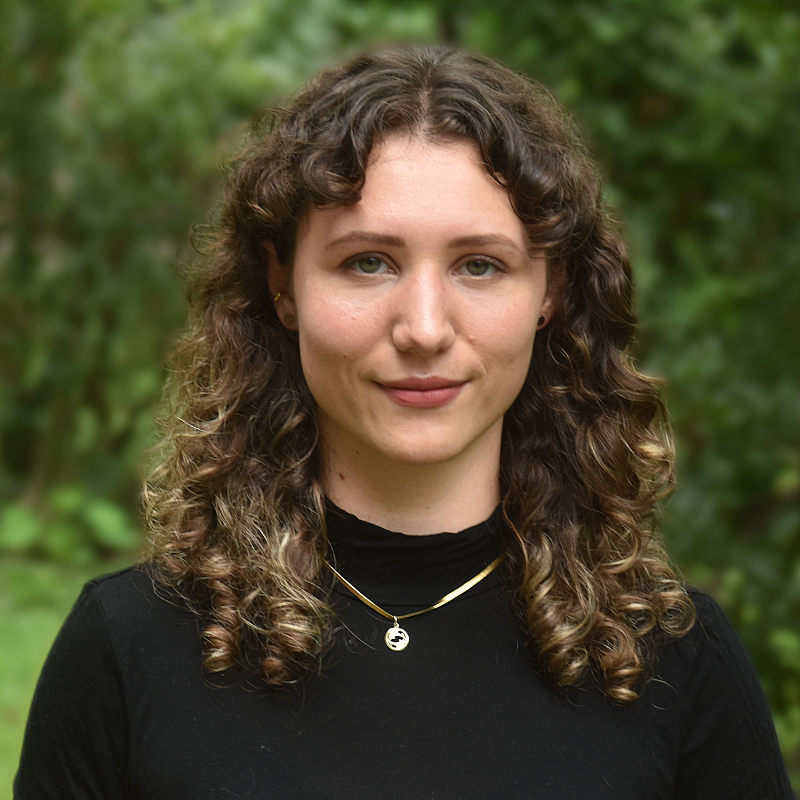
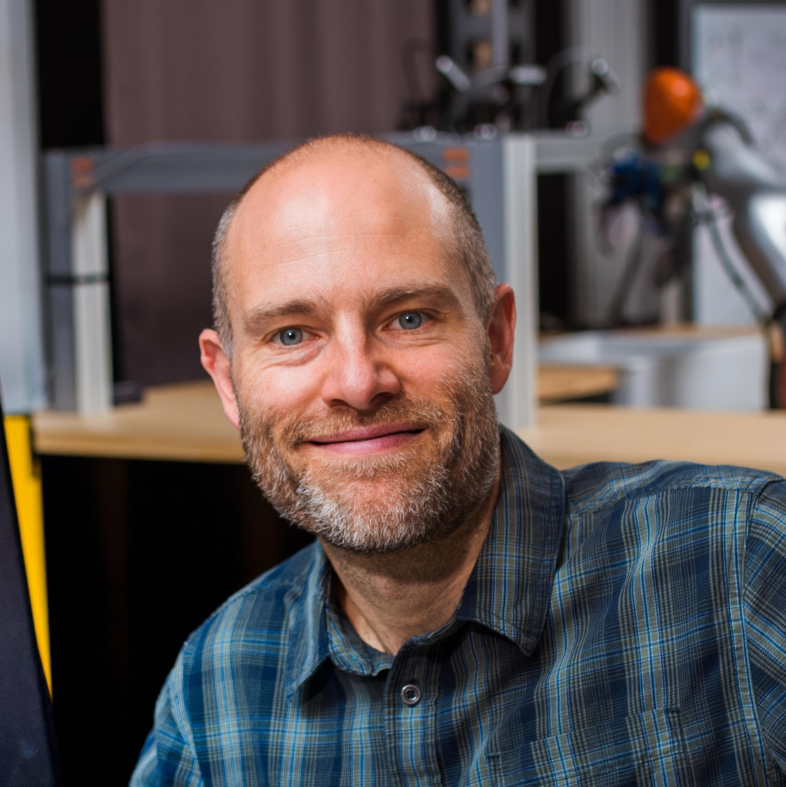
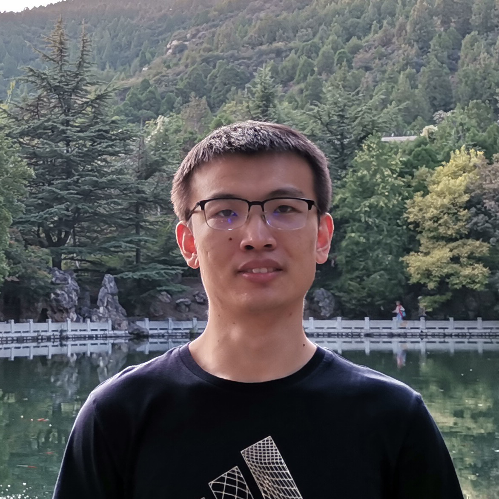
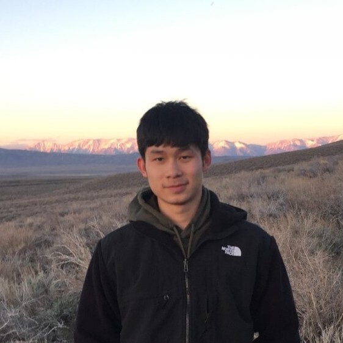
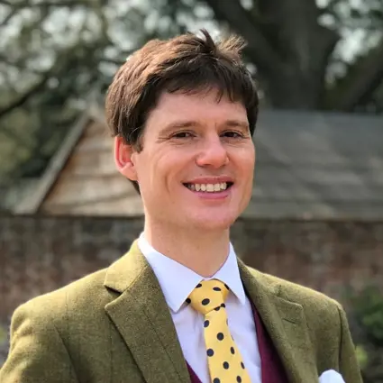
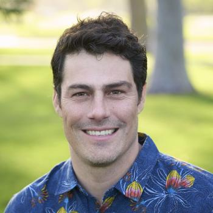
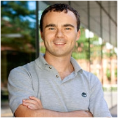

---
# Feel free to add content and custom Front Matter to this file.
# To modify the layout, see https://jekyllrb.com/docs/themes/#overriding-theme-defaults

permalink: /
title: "GRATE-VLA Challenge: Safe Real-World Generalization for Generalist Robot Manipulation Policies"
list_title: Home
layout: home
---

    <h1 class="page-heading" align="center">
GRATE-VLA Challenge: Safe Real-World Generalization for Generalist Robot Manipulation Policies
</h1>
    
<em>Achieving Generalization via Predictive Redteaming and World Model Grounding</em>
    

    
<a href="https://www.corl.org/">2025 Conference on Robot Learning in Seoul, South Korea</a>
    

    
September 30, 2025. Location: <a href="https://maps.app.goo.gl/dHWrPx9CABdTPmyi8">COEX Convention & Exhibition Center</a>

    <!-- 
Location: Sequoia 1
 -->
    

    <!-- [<a href="">Youtube</a>] -->[<a href="">Discord</a>] [<a href="">OpenReview</a>]

    <!-- 
Recording available at: <a href="">Youtube</a>
 -->

Research on vision-language-action (VLA) models as generalist robot policies has
exploded over the last few years, achieving remarkable performance across a wide
range of robot manipulation tasks described in natural-language. Despite their notable performance in
nominal conditions, VLA policies have been shown to be notably fragile, showing weak robustness to
distractors (e.g., objects, lighting, and backgrounds) and poor generalization to robot embodiments
and some manipulation tasks, demonstrated by a few failure videos from state-of-the-art open-source VLAs 
(Octo and OpenVLA):

  <video autoplay controls muted loop playsinline>
    <source src="assets/img/octo--move_corn_onto_plate.mp4" type="video/mp4">
  </video>
  <video autoplay controls muted loop playsinline>
    <source src="assets/img/openvla--pour_corn.mp4" type="video/mp4">
  </video>
  <video autoplay controls muted loop playsinline>
    <source src="assets/img/openvla--put_carrot.mp4" type="video/mp4">
  </video>
  <!-- <video autoplay controls muted loop playsinline, width="80%">
    <source src="assets/img/openvla--cover_white_bowl_with_towel.mp4" type="video/mp4">
  </video> -->

However, robustness and generalization to real-world conditions remain essential to moving the
deployment of robots from controlled lab settings to the real-world (lab-to-real). This challenge aims
to bring together the robot manipulation research community to address these fundamental issues in
three research directions. This challenge seeks to:
- Promote research on predictive redteaming to enable stable fine-tuning of VLA policies,
through the: (i) identification of interesting failure scenarios, (ii) targeted collection of fine-tuning data, 
and (iii) optimization of data-mix ratios during fine-tuning to avoid catastrophic
forgetting. Fine-tuning VLA policies with supervision on failure cases can improve their
generalization beyond the training distribution.
- Motivate research on grounding VLA policies in the real-world at runtime with world
models. Effective grounding can evaluate and optimize VLA action proposals, mitigating
hallucinations for robustness to distractors.
- Encourage research on runtime performance prediction of VLA policies for safety guarantees
and promote research on safety verification of VLA policies using formal methods.

### Challenge
The Generalizable Real-World Robot Manipulation Policies Across Tasks and Environments Challenge (GRATE-VLA) invites researchers to develop generalist robot policies that work
in real-world manipulation problems, and by design, requires these policies to be generalizable
and robust to the uncontrolled conditions in the real-world. Specifically, we evaluate real-world
generalization across:
1. Robot embodiments, e.g., Franka, WidowX, X-Arm, Kinova, etc.
2. Task skills, e.g., picking, sliding, and pushing.
3. Task objects, e.g., fruits, mugs, and pans.
4. Environments with distractors and varied scene conditions, e.g., lighting, texture, mass, etc.
Each participant is required to submit a report detailing the architecture of their policy, training data,
implementation, training costs, etc, as specified in the challenge rules. The challenge unequivocally
encourages participants to use open-source datasets, whenever possible. Participants are encouraged
to release their training datasets as part of their submission.
The challenge consists of two stages. In the first stage, participants train and submit their VLA
policies for evaluation in simulation and hardware on a challenge evaluation platform, e.g., EvalAI,
set up by the organizers of this challenge. The results for each track of the challenge will be published
on a leaderboard. Top-performing participants in the first stage advance to the second stage of the
challenge.

The second stage of the challenge will be conducted entirely in-person at the workshop. Participants
in the second stage are required to submit their policy for evaluation in real-time at the workshop.
The top participants in this round will give a brief talk on architecture design choices and key insights
at the workshop.

The winners of the challenge in each track will receive suitable awards, acknowledging their achievements. Winners in the overall track will receive the following prizes:
- First Place: $1000
- Second Place: $750
- Third Place: $500

All top-ranked participants will receive API credits for use with world models, and VLMs from sponsors. The challenge will recognize the <b>Best Student (Academic) Submission</b>, limited to submissions
unaffiliated with any industry partner. In addition, the challenge will present awards to submissions
that innovate on the three research directions of this challenge.

More details about the challenge will be presented at a later date.

&nbsp;
&nbsp;

### Call for papers

The challenge will feature five keynote addresses by leading researchers
on target data collection for efficient fine-tuning of VLAs, grounding VLAs with world models,
enforcing safety in VLAs, and designing VLA policies for robustness. Moreover, the workshop will
feature a panel discussion on the crucial question: “Is data scaling the key to robust, generalizable
VLA policies?,” where participants will get the opportunity to ask the panelists research-provoking
questions. We hope these discussion spark useful research collaborations. Lastly, the challenge
invites researchers to submit papers on their research related to aforementioned research themes of
this challenge. The challenge will include poster sessions for accepted paper submissions, particularly
focused on early-stage/on-going research to further provide an opportunity for presenters to share their
work and receive feedback. The authors of the best paper submissions will be given an opportunity
for an oral presentation of their work.

This challenge invites all robot manipulation researchers to submit their
contributions on generalist robot manipulation policies that generalize to the real-world. The challenge
is designed to be accessible to all researchers, regardless of the researcher’s access to research
resources, by allowing for the use of open-source training data, and open-source pretrained policies
for bootstrapping their submissions. In particular, we encourage submissions that:
1. Provide simple interfaces for policy deployment with interpretable action proposals and
performance predictions,
2. Utilize open-source datasets and foundation models for training generalist robot manipulation policies,
3. Leverage predictive redteaming for target data collection and fine-tuning,
4. Harness open-source world models for efficient data scaling and grouding, especially
centered on failure scenarios.

**Important Dates**
- **Paper submission open**: TBD

- **Paper submission deadline**: TBD

- **Notification of acceptance**: TBD

- **Camera ready**: TBD

- **Workshop date**: TBD

- **Submission portal**: TBD

We expect submissions with 2 - 8 pages for the main content, with no limit on references/appendices. Submissions are suggested to use the [CoRL template](https://drive.google.com/file/d/1XalwYG542cg2YAHo8STgZKxhAIA8_HSu/view). All papers will be peer-reviewed in a double-blind manner. In particular, we encourage submission of preliminary and on-going research. 
Accepted papers will be presented during a poster session at the workshop. 
The <b>Best Paper Award</b> and <b>Best Poster Award</b> will be presented to honor outstanding contributions.

**Contact**

If you have any questions, please contact us at: TBD.

&nbsp;
&nbsp;
### Invited Speakers
&nbsp;

    

        <figure>
        
        <figcaption><b><a href="https://robodhruv.github.io/">Dhruv Shah</a></b> Google DeepMind & Princeton</figcaption>
        </figure>
    

    

        <figure>
         
        <figcaption><b><a href="https://shurans.github.io/">Shuran Song</a></b> Stanford</figcaption>
        </figure>
    

    

        <figure>
         
        <figcaption><b><a href="https://shuangli59.github.io/">Shuang Li</a></b> Stanford</figcaption>
        </figure>
    

    

        <figure>
        
        <figcaption><b><a href="https://huihanl.github.io/">Huihan Liu</a></b> UT Austin</figcaption>
        </figure>
    

    

        <figure>
        
        <figcaption><b><a href="https://www.cs.cmu.edu/~abajcsy/">Andrea Bajcsy</a></b> CMU</figcaption>
        </figure>
    

    

        <figure>
        
        <figcaption><b><a href="https://people.eecs.berkeley.edu/~svlevine/">Sergey Levine
</a></b> UC Berkeley & PI</figcaption>
        </figure>
    

    

        <figure>
        
        <figcaption><b><a href="https://locomotion.csail.mit.edu/russt.html">Russ Tedrake</a></b> MIT & TRI</figcaption>
        </figure>
    

    

        <figure>
        
        <figcaption><b><a href="https://chuchu.mit.edu/">Chuchu Fan</a></b> MIT</figcaption>
        </figure>
    

    <!-- 

        <figure>
        
        <figcaption><b><a href="">Tiffany Cai</a></b> Nvidia</figcaption>
        </figure>
    
 -->

&nbsp;

### Organizers
&nbsp;

    <!-- 

        <figure>
         
        <figcaption><b><a href="">Ola Shorinwa</a></b> Princeton University</figcaption>
        </figure>
    
 -->
    

        <figure>
        
        <figcaption><b><a href="https://web.stanford.edu/~jksun">Jiankai Sun</a></b> Stanford University</figcaption>
        </figure>
    

    

        <figure>
        
        <figcaption><b><a href="https://scholar.google.com/citations?user=JW4F5HoAAAAJ&hl=en">Haibao Yu</a></b> University of Hong Kong</figcaption>
        </figure>
    

    

        <figure>
        
        <figcaption><b><a href="https://decayale.github.io/">Yan Xu</a></b> University of Michigan</figcaption>
        </figure>
    

    

        <figure>
        
        <figcaption><b><a href="https://msl.stanford.edu/people/timchen">Timothy Chen</a></b> Stanford University</figcaption>
        </figure>
    

    

        <figure>
        
        <figcaption><b><a href="https://web.eecs.umich.edu/~stellayu/">Stella X. Yu</a></b> University of Michigan</figcaption>
        </figure>
    

    

        <figure>
        
        <figcaption><b><a href="https://profiles.stanford.edu/steven-collins">Mac Schwager</a></b> Stanford University</figcaption>
        </figure>
    

    

        <figure>
        
        <figcaption><b><a href="https://irom-lab.princeton.edu/majumdar/">Anirudha Majumdar</a></b> Princeton University</figcaption>
        </figure>
    

<!-- ### Scientific Advisory Board
&nbsp; -->
<!-- 

    

        <figure>
        
        <figcaption><b><a href="https://profiles.stanford.edu/lei-xing">Lei Xing</a></b> Stanford University</figcaption>
        </figure>
    

    

        <figure>
        
        <figcaption><b><a href="https://seas.harvard.edu/person/patrick-slade">Patrick Slade</a></b> Harvard University</figcaption>
        </figure>
    

    

        <figure>
        
        <figcaption><b><a href="https://www.eas.caltech.edu/people/weigao">Wei Gao</a></b> Caltech</figcaption>
        </figure>
    

    

        <figure>
        
        <figcaption><b><a href="https://www.mccormick.northwestern.edu/research-faculty/directory/profiles/rogers-john.html">John A. Rogers</a></b> Northwestern University</figcaption>
        </figure>
    

    

        <figure>
        
        <figcaption><b><a href="https://www.cse.cuhk.edu.hk/~pheng/">Pheng Ann Heng</a></b> CUHK</figcaption>
        </figure>
    

    

        <figure>
        
        <figcaption><b><a href="https://www.cs.unc.edu/~zlj/">Liang-Jun Zhang</a></b> Baidu</figcaption>
        </figure>
    

    

        <figure>
        
        <figcaption><b><a href="https://www.wearablesystems.org/people#/peter-shull">Peter Shull</a></b> Shanghai Jiao Tong University</figcaption>
        </figure>
    

    

        <figure>
        
        <figcaption><b><a href="https://www.imperial.ac.uk/people/e.yeatman">Eric Yeatman</a></b> Imperial College London</figcaption>
        </figure>
    

    

        <figure>
        
        <figcaption><b><a href="http://www.bme.cuhk.edu.hk/kytong/">Raymond Tong</a></b> CUHK</figcaption>
        </figure>
    

    

        <figure>
        
        <figcaption><b><a href="https://eng.ox.ac.uk/people/david-clifton/">David Clifton</a></b> University of Oxford</figcaption>
        </figure>
    

    

        <figure>
        
        <figcaption><b><a href="https://med.stanford.edu/profiles/david-camarillo">David Camarillo</a></b> Stanford University</figcaption>
        </figure>
    

    

        <figure>
        
        <figcaption><b><a href="https://people.seas.harvard.edu/~samurphy/">Susan A. Murphy</a></b> Harvard University</figcaption>
        </figure>
    

    

        <figure>
        
        <figcaption><b><a href="https://nmbl.stanford.edu/people/scott-delp/">Scott L. Delp</a></b> Stanford University</figcaption>
        </figure>
    

    

        <figure>
        
        <figcaption><b><a href="https://biodesign.seas.harvard.edu/conor-walsh">Conor Walsh</a></b> Harvard University</figcaption>
        </figure>
    

 -->
<!-- &nbsp; -->

### Program Committee
The program committee will be announced soon.
&nbsp;

<!-- 

    

        

&#8226;&nbsp;<a href="https://zipingxu.github.io/">Ziping Xu</a> (Harvard)

        

&#8226;&nbsp;<a href="https://schmidtsciencefellows.org/fellow/asim-gazi/">Asim Gazi</a> (Harvard)

        

&#8226;&nbsp;<a href="https://treelli.github.io/">Lin Li</a> (KCL)

        

&#8226;&nbsp;<a href="https://www.gla.ac.uk/schools/computing/staff/fanideligianni/">Fani Deligianni</a> (UofG)

         

&#8226;&nbsp;<a href="https://scholar.google.com/citations?user=mabc04YAAAAJ&hl=en">Kyle Lam</a> (Imperial)

        

&#8226;&nbsp;<a href="https://www.researchgate.net/scientific-contributions/Zeyu-Wang-2216092052">Zeyu Wang</a> (Imperial)

    

    

        

&#8226;&nbsp;<a href="https://anyirao.com/">Anyi Rao</a> (Stanford)

        

&#8226;&nbsp;<a href="https://jiaqixuac.github.io/">Jiaqi Xu</a> (CUHK)

        

&#8226;&nbsp;<a href="https://scholar.google.com/citations?user=LXwEufAAAAAJ&hl=en&oi=ao">Chuheng Wei</a> (UC Riverside)

        

&#8226;&nbsp;<a href="https://uk.linkedin.com/in/nlkaur">Narinder Kaur</a> (UofG)

        

&#8226;&nbsp;<a href="">Shuai Jiang</a> (Sun Yat-sen University)

        

&#8226;&nbsp;<a href="https://ieeexplore.ieee.org/author/37086579788">Lipeng Chen</a> (Tencent Robotics X)

    

    

        

&#8226;&nbsp;<a href="https://scholar.google.co.uk/citations?user=lLHEIC4AAAAJ&hl=en">Frank P. -W. Lo</a> (Imperial)

        

&#8226;&nbsp;<a href="https://scholar.google.co.uk/citations?user=sLRZCxMAAAAJ&hl=en">Yingnan Sun</a> (OPPO)

        

&#8226;&nbsp;<a href="https://scholar.google.com/citations?user=JW4F5HoAAAAJ&hl=zh-CN">Haibao Yu</a> (HKU)

        

&#8226;&nbsp;<a href="https://scholar.google.com/citations?user=rHHZrQEAAAAJ&hl=zh-CN">Bo Xiao</a> (Imperial)

        

&#8226;&nbsp;<a href="https://scholar.google.com/citations?user=WFxAYYQAAAAJ&hl=en">Lei Lu</a> (KCL)

    

 -->

### Sponsors
&nbsp;
Information on sponsors will be posted soon.

<!-- 

    

        <figure>
        
        </figure>
    

 -->
